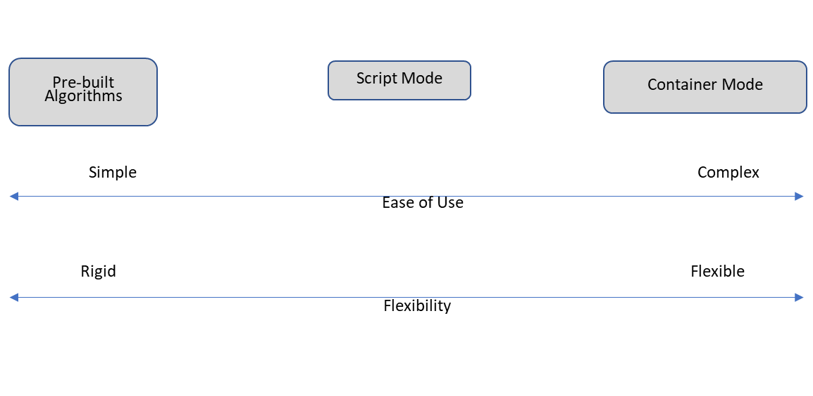

# Creating and Deploying a Custom Model in Sagemaker
David Hren

In this blog, we will give an example of defining machine learning model in Python and then deploying it using Amazon Sagemaker. I have made a public repository on [GitHub](https://github.com/hrenski/custom-model-sagemaker) so you can follow along on some of the details and for reference. AWS also maintains an [extension collection of examples](https://github.com/awslabs/amazon-sagemaker-examples) that you can use for reference.

### Overview of Sagemaker Models

SageMaker uses Docker containers to compartmentalize ML algorithms; this container approach allows SageMaker to offer a wide range of readily available algorithms for common use-cases while remaining flexible enough to support models developed using common libraries or even a completely custom written model. The model containers can be used on three basic levels:

1.	Pre-built Algorithms – fixed class of algorithms fully maintained by AWS
2.	"Script Mode" – allows popular ML frameworks to be utilized via a script 
3.	"Container Mode" – allows for a fully customized ML algorithm to be used

These modes offer various degrees of both complexity and ease of use. 



First, we will give a brief rundown of each mode, but we will focus showing a step-by-step process to use container mode to deploy a machine learning model. If you are new to using Sagemaker, you can find a series of [deep dive videos](https://www.youtube.com/playlist?list=PLhr1KZpdzukcOr_6j_zmSrvYnLUtgqsZz) produced by AWS helpful. 

In addition to the standard [AWS SDKs](https://aws.amazon.com/tools/), Amazon also has a higher level Python package (the [Sagemaker Python SDK](https://sagemaker.readthedocs.io/en/stable/#)) for training and deploying models using Sagemaker, which we will use here.

##### Pre-built Algorithms
SageMaker offers following pre-built algorithms that can tackle a wide range of problem types and use cases. AWS maintains all of the containers associated with these algorithms. You can find the full list of available algorithms and read more about each one on the [SageMaker documentation page](https://docs.aws.amazon.com/sagemaker/latest/dg/algos.html).

##### Script Mode
Script mode allows you to write Python scripts against commonly used machine learning [frameworks](https://sagemaker.readthedocs.io/en/stable/frameworks/index.html). AWS still maintains the underlying container hosting whichever framework you choose, and your script is embedded into the container and used to direct the logic during runtime. In order for you script to be compatible with the AWS maintained container, the script must meet certain design requirements.

##### Container Mode
Container mode allows you to to use custom logic to define a model and deploy it into the SageMaker ecosystem; in this mode you for maintaining both the container and the underlying logic it implements. This mode is the most flexible and can let you access the many Python libraries and machine learning tools available. In order for the container to be compatible with SageMaker, your container must meet certain design requirements. This can be accomplished in one of two ways:

1. Define your custom container by extending one of the existing ones maintained by AWS
2. Use the [SageMaker Containers Library](https://github.com/aws/sagemaker-training-toolkit) to define your container.

We will focus on using method 1. here, but AWS really has made every effort to make it as easy as possible to use your own custom logic within Sagemaker.

After designing you container, you must uploaded it to the AWS Elastic Container Registry (ECR); this is the model image you will point SageMaker to when training or deploying a model.

### Outline of the Steps

Here we will outline the basic steps involved in creating and deploying a custom model in Sagemaker. 

1. Define the logic of the machine learning model
2. Define the model image
3. Build and Push the container image to Amazon Elastic Container Registry (ECR)
3. Train and deploy the model image

As an overview, the entire structure of our custom model will like something like this.

```
.
├── container
│   ├── build_and_push.sh
│   ├── code
│   │   ├── model_logic.py
│   │   └── requirements.txt
│   ├── Dockerfile
│   ├── gam_model
│   │   ├── gam_model
│   │   │   ├── __init__.py
│   │   │   └── _models.py
│   │   ├── gen_pack.sh
│   │   └── setup.py
```

The directory ```gam_model``` contains the core logic of the custom model. The directory ```code``` contains the code that instructs our container on how to use the model within Sagemaker (model training, saving, loading, and inferencing). Of the remaining files, ```DockerFile``` defines the docker image, and ```build_and_push.sh``` is a helper bash script (that I found [here](https://github.com/awslabs/amazon-sagemaker-examples/blob/master/advanced_functionality/pytorch_extending_our_containers/container/build_and_push.sh)) to push our container to ECR so we can use it within Sagemaker. We will look at each piece in more detail as we go through each step.

### Defining the Logic of the Model

For our custom machine learning model, we will be using a generalized additive model (or GAM). GAMs are a powerful, yet interpretable, algorithm that can detect non-linear relationships (possibly interactions as well). If you aren't familiar with GAMs, Kim Larson has a very helpful [blog](https://multithreaded.stitchfix.com/blog/2015/07/30/gam/) introducing them; Micheal Clark also has a nice [description](https://m-clark.github.io/generalized-additive-models/preface.html). Also note, there is a very nice python package implementing GAMs with a lot of nice features: [pyGAM](https://pygam.readthedocs.io/en/latest/), but for our purpose, we will make use of the [statsmodels](https://www.statsmodels.org/stable/gam.html) package.

When creating a container with a custom model, I generally like to put the actual implementation of the machine learning algorithm within its own Python package. This allows me to compartmentalize the logic of the model with the logic needed to run it in Sagemaker and to modify and test each part independently. I can also then reuse the model in other environments as well.

We will call our package ```gam_model```; I'm including it within our container definition directory just to make it simplier to include it within the container we will define shortly.

In this case, our package will look like:

```
.
├── gam_model
│   ├── __init__.py
│   └── _models.py
├── gen_pack.sh
└── setup.py
```

This is a fairly simple Python module which wraps the statsmodel GAM implementation into a scikit-learn like model; the contents of ```_models.py``` is

```python
import numpy as np
from sklearn.base import BaseEstimator, RegressorMixin
from sklearn.utils.validation import check_is_fitted
from sklearn.utils import check_array
from statsmodels.gam.api import GLMGam, BSplines

class GAMRegressor(BaseEstimator, RegressorMixin):
    def __init__(self, df = 15, alpha = 1.0, degree = 3):
        self.df = df
        self.alpha = alpha
        self.degree = degree
    
    def fit(self, X, y):
        X, y = self._validate_data(X, y, y_numeric=True)
        
        self.spline = BSplines(
            X, df = [self.df] * self.n_features_in_, 
            degree = [self.degree] * self.n_features_in_, 
            include_intercept = False
        )
        
        gam = GLMGam(
            y, exog = np.ones(X.shape[0]), 
            smoother = self.spline, alpha = self.alpha
        )
        self.gam_predictor = gam.fit()
        
        return self

    def predict(self, X):
        check_is_fitted(self, attributes = "gam_predictor")
        X = check_array(X)
        
        return self.gam_predictor.predict(
            exog = np.ones(X.shape[0]), 
            exog_smooth = X
        )
    
    @property
    def summary(self):
        return self.gam_predictor.summary() if \
               hasattr(self, "gam_predictor") else None
```

```gen_pack.sh``` is just a little helper script to rebuilds and installs the package every time I need to modify it. The other components of the package are pretty standard and can found on the corresponding [GitHub page](https://github.com/hrenski/custom-model-sagemaker).

### Defining the Model Image

Now that we have our model implemented and put into a package, the next step is to define the Docker container image that will house our model within the AWS ecosystem. To do this, we first write our ```DockerFile```:

```dockerfile
ARG REGION=us-east-1

FROM 683313688378.dkr.ecr.us-east-1.amazonaws.com/sagemaker-scikit-learn:0.23-1-cpu-py3

ENV PATH="/opt/ml/code:${PATH}"

COPY /code /opt/ml/code
COPY gam_model/dist/gam_model-0.0.1-py3-none-any.whl /opt/gam_model-0.0.1-py3-none-any.whl

RUN pip install -r /opt/ml/code/requirements.txt /opt/gam_model-0.0.1-py3-none-any.whl

ENV SAGEMAKER_PROGRAM model_logic.py
```

Here we are using one of the container images that AWS has created and maintins for the the scikit-learn framework. You can find the current framework containers in the Sagemaker documentation pages ([here](https://docs.aws.amazon.com/sagemaker/latest/dg/pre-built-containers-frameworks-deep-learning.html) and [here](https://docs.aws.amazon.com/sagemaker/latest/dg/pre-built-docker-containers-frameworks.html)). By extending their container, we can take advantage of everything that they have already done to set it up and just worry about including our additional code and features (we'll review this more shortly). We then copy in the wheel file of the gam_model package and install it as well as some other dependencies. Lastly, we set the Python file, ```model_logic.py``` as my entry point for the container.

Since we are extending one of AWS's framework containers, we need to make sure that my instructions for the logic the container should run meets the design requirements laid out in the [sagemaker-python-sdk documentation](https://sagemaker.readthedocs.io/en/stable/frameworks/sklearn/using_sklearn.html). You can read more about the general Sagemker contianers requirements in the [Sagemaker documentation page](https://sagemaker.readthedocs.io/en/stable/frameworks/sklearn/using_sklearn.html) as well as at the [sagemaker-containers page](https://github.com/aws/sagemaker-containers).

In our case, the ```code``` directory looks like

```
├── model_logic.py
└── requirements.txt
```

```requirements.txt``` contains some additional packages we wish to install in the container, and ```model_logic.py``` contains the instructions on how we want the container to train, load, and serve the model. The training portion looks like

```python
import argparse
import os
import json
import pandas as pd
import numpy as np
import joblib
from gam_model import GAMRegressor

if __name__ =='__main__':

    print('initializing')
    parser = argparse.ArgumentParser()
    gam = GAMRegressor()
    gam_dict = gam.get_params()


    # Data, model, and output directories
    parser.add_argument('--output-data-dir', 
                        type = str, 
                        default = os.environ.get('SM_OUTPUT_DATA_DIR'))
    parser.add_argument('--model-dir', 
                        type = str, 
                        default = os.environ.get('SM_MODEL_DIR'))
    parser.add_argument('--train', 
                        type = str, 
                        default = os.environ.get('SM_CHANNEL_TRAIN'))
    parser.add_argument('--train-file', type = str)
    parser.add_argument('--test', 
                        type = str, 
                        default = os.environ.get('SM_CHANNEL_TEST'))
    parser.add_argument('--test-file', type = str, default = None)
    
    for argument, default_value in gam_dict.items():
        parser.add_argument(f'--{argument}', 
                            type = type(default_value),
                            default = default_value)

        
    print('reading arguments')
    args, _ = parser.parse_known_args()

    print(args)
    
    
    print('setting parameters')
    gam_dict.update({key: value for key, value in vars(args).items()\
                    if key in gam_dict and value is not None})
    gam.set_params(**gam_dict)
    
    print(gam)

    
    print('reading training data') 
    # assume there's no headers and the target is the last column
    data = np.loadtxt(os.path.join(args.train, args.train_file), delimiter = ',')
    X = data[:, :-1]
    y = data[:, -1]
    
    print("X shape:", X.shape)
    print("y shape:", y.shape)

    if args.test_file is not None:
        print('reading training data') 
        # assume there's no headers and the target is the last column
        data = np.loadtxt(os.path.join(args.test, args.test_file), delimiter = ',')
        X_test = data[:, :-1]
        y_test = data[:, -1]

        print("X_test shape:", X_test.shape)
        print("y_test shape:", y_test.shape)
    else:
        X_test = None
        y_test = None
    
    
    print('fitting model') 
    gam.fit(X, y)
    
    print("R2 (train):", gam.score(X, y))
    
    if X_test is not None:
        print("R2 (test):", gam.score(X_test, y_test))
    

    print('saving model') 
    path = os.path.join(args.model_dir, "model.joblib")
    print(f"saving to {path}")
    joblib.dump(gam, path)

```

Loading the model is as simple as

```python
def model_fn(model_dir):
    model = joblib.load(os.path.join(model_dir, "model.joblib"))
    return model
```

and using the model to make predictions is

```python
def predict_fn(input_object, model):
    return model.predict(input_object)
```

Note that if we wanted to be able to use difference serialization/deserialization techniques with our model within Sagemakker, we could also define ```input_fn``` and ```output_fn```. But we will make use of the default implementations which serializer/deserializer numpy arrays.

### Build and Push the container image to Amazon Elastic Container Registry (ECR)

Now that we have all the ingredients for our container, we can build it and push it to ECR. We do this by 

```
./build_and_push.sh gam-model
```

**Note:** I have the hard coded the region in both my ```DockerFile``` and in ```build_and_push.sh``` to pull from ```us-east-1 (account id 683313688378)``` you can adjust this to another region by referencing the [doc page](https://docs.aws.amazon.com/sagemaker/latest/dg/pre-built-docker-containers-frameworks.html).

Once you have done this, you can go to your AWS Console, nagivate to ECR, and make note of your model image's uri


### Training and Deploying the Custom Model

Now that we have defined our model image and registered with with ECR, we can use Sagemaker to train and deploy our model! You can follow this process referencing the [example.ipynb](https://github.com/hrenski/custom-model-sagemaker/blob/master/example.ipynb) notebook.

For this example, we will use a small relatively simple dataset that will display a GAMs ability to model nonlinear relationships: the [Gauss3](https://www.itl.nist.gov/div898/strd/nls/data/gauss3.shtml) dataset.


We first import the necessary libraries and run some initilization

```python
import requests
import sagemaker
import boto3
import s3fs
import json
import io

import numpy as np

from sklearn.model_selection import train_test_split
from sklearn.metrics import r2_score

from sagemaker.estimator import Estimator
from sagemaker.predictor import Predictor
from sagemaker.serializers import NumpySerializer
from sagemaker.deserializers import NumpyDeserializer
from sagemaker.local import LocalSession

from matplotlib import pyplot as plt
import matplotlib as mpl
import seaborn as sns

%matplotlib inline
sns.set()

seed = 42
rand = np.random.RandomState(seed)

local_mode = False # activate to use local mode

with open("config.json") as f:
    configs = json.load(f)
    
default_bucket = configs["default_bucket"] #put your bucket name here
role = configs["role_arn"] # put your sagemaker role arn here

boto_session = boto3.Session()
   
if local_mode:
    sagemaker_session = LocalSession(boto_session = boto_session)
    sagemaker_session._default_bucket = default_bucket
else:
    sagemaker_session = sagemaker.Session(
        boto_session = boto_session,
        default_bucket = default_bucket
    )

ecr_image = configs["image_arn"] #put the image uri from ECR here

prefix = "modeling/sagemaker"

data_name = f"gauss3"
test_name = "gam-demo"    
```

Note that I'm using a configs file to store my S3 bucket name, sagemaker role, and training image URI, but you can also set these directly. Next we define two helpr functions. I also include logic to train and deploy the model locally or on Sagemaker instances.

```python
def get_s3fs():
    return s3fs.S3FileSystem(key = boto_session.get_credentials().access_key,
                             secret = boto_session.get_credentials().secret_key,
                             token = boto_session.get_credentials().token)

def plot_and_clear():
    plt.show()
    plt.clf()
    plt.cla()
    plt.close()
```

We can retrieve the Gauss data using the requests module and apply a train-test-split.

```python
url = "https://www.itl.nist.gov/div898/strd/nls/data/LINKS/DATA/Gauss3.dat"

r = requests.get(url)

y, x = np.loadtxt(
    io.StringIO(r.text[r.text.index("Data:   y          x"):]), 
    skiprows=1, unpack=True
)

x = x.reshape(-1, 1)

X_train, X_test, y_train, y_test = train_test_split(
    x, y, test_size = 0.25, 
    random_state = rand
)
```

After writing the training data to our S3 bucket,

```python
file_fn = f"{default_bucket}/{prefix}/{data_name}/train/data.csv"
file_path = f"s3://{file_fn}"

s3 = get_s3fs()
with s3.open(file_fn, 'wb') as f:
    np.savetxt(f, np.c_[X_train, y_train], delimiter = ',')
```

we can train our model.


```python
hyperparameters = {
    "train-file": "data.csv",
    "df": "20"
}

data_channels = {
    "train": file_path
}

estimator = Estimator(
    role = role,
    sagemaker_session = sagemaker_session,
    instance_count = 1,
    instance_type = "local" if local_mode else "ml.m5.large",
    image_uri = ecr_image,
    base_job_name = f'{data_name}-{test_name}',
    hyperparameters = hyperparameters,
    output_path = f"s3://{default_bucket}/{prefix}/{data_name}/model"
)

estimator.fit(data_channels, wait = True, logs = "None")
job_name = estimator.latest_training_job.name
print(job_name)
```

Once the model is trained, we can deploy it to make real-time inferences.

```python
np_serialize = NumpySerializer()
np_deserialize = NumpyDeserializer()

predictor = estimator.deploy(
    initial_instance_count = 1,
    instance_type = "local" if local_mode else "ml.t2.medium",
    serializer = np_serialize,
    deserializer = np_deserialize
)
```

Now let's get model predictions on the training and testing data and compare against the acutal data.

```python
y_hat_train = predictor.predict(X_train)
y_hat_test = predictor.predict(X_test)
```


We can see that the GAM found a smooth representation which captures the non-linearity of the data.

Be sure to delete the model endpoint when you are done testing the model.

```python
predictor.delete_endpoint()
predictor.delete_model()
```

### Conclusion

We have outlined the process of creating our own container image in Sagemaker and showed how it can be used to train and deploy a custom machine learning model. Hopefully this has been helpful and will serve as a useful reference.

*Note:* If you have trouble during this process, be sure to check the Cloudwatch log groups for your Sagemaker building, training, and deployment instances. They are your best friend for finding and resolving issues!
